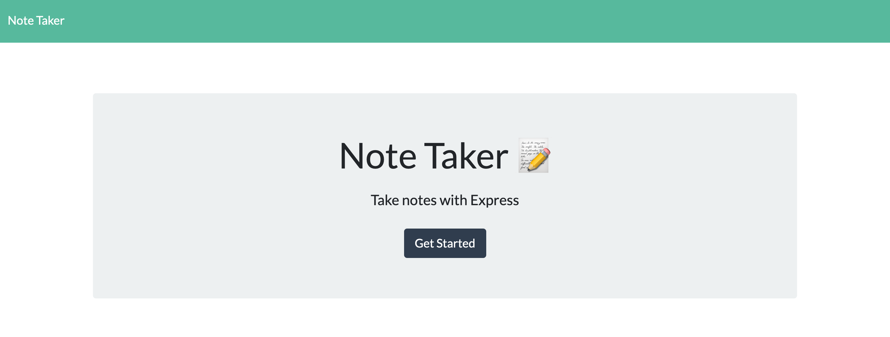
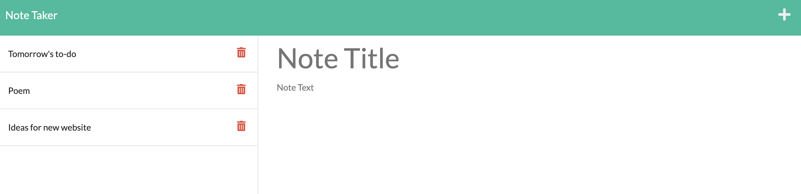

# Note Taker

### Technologies Used


-------------------------------------------------------------

## Table of Contents
* [General Info](#general-information)
  1. [User Story](#user-story)
  2. [Acceptance Criteria](#acceptance-criteria)
* [Screenshots](#screenshots)
* [Project Status](#project-status)
* [Contact](#contact)
* [Demo](#demo)

## General Information

Notetaker was created with express.js to allow users to have one location for their notes online. When the user logs in, they will find an empty notepad to the left that when filled, generates the option to save the note to the note's array. The left hand side features a list of the previously recorded notes, each of which can be deleted when no longer relevant to the user. 

### USER STORY
```
AS A small business owner
I WANT to be able to write and save notes
SO THAT I can organize my thoughts and keep track of tasks I need to complete
```

### ACCEPTANCE CRITERIA
```
GIVEN a note-taking application
WHEN I open the Note Taker
THEN I am presented with a landing page with a link to a notes page
WHEN I click on the link to the notes page
THEN I am presented with a page with existing notes listed in the left-hand column, plus empty fields to enter a new note title and the note’s text in the right-hand column
WHEN I enter a new note title and the note’s text
THEN a Save icon appears in the navigation at the top of the page
WHEN I click on the Save icon
THEN the new note I have entered is saved and appears in the left-hand column with the other existing notes
WHEN I click on an existing note in the list in the left-hand column
THEN that note appears in the right-hand column
WHEN I click on the Write icon in the navigation at the top of the page
THEN I am presented with empty fields to enter a new note title and the note’s text in the right-hand column
```

## Screenshots




## Project Status

Project is _in review_. 

## Contact

Created by [@3lydaley](https://github.com/3lyDaley) - feel free to contact me!

## Demo

https://user-images.githubusercontent.com/100460009/178376217-2c6f8508-62d5-4b57-83c3-e1cbca051d89.mp4


